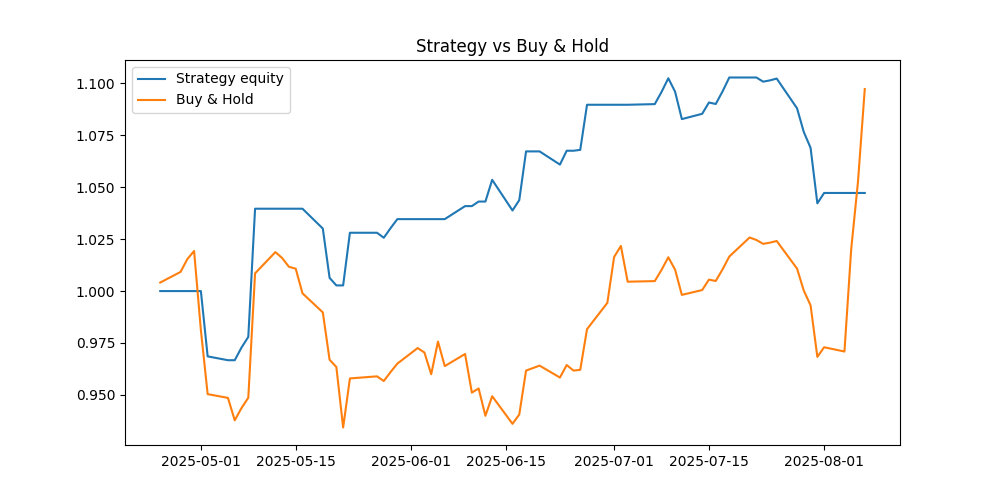
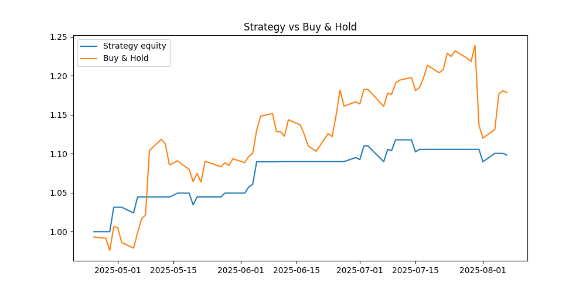
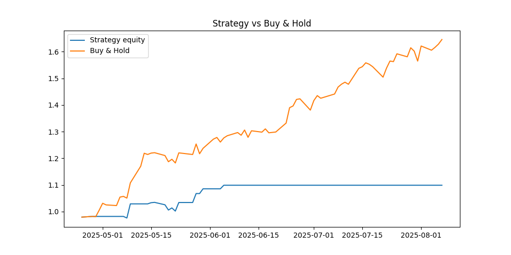

# Stock Price Prediction and Backtesting Project

This project demonstrates a simple machine learning pipeline applied to stock price data, combining my interest in investing with a hands-on approach to learning ML techniques. The goal is to predict the next day's closing price of a stock and evaluate a basic trading strategy based on these predictions.

---

## Features

- **Data Collection:**  
  Historical stock price and volume data are fetched from Yahoo Finance using the `yfinance` library.

- **Feature Engineering:**  
  The model uses lagged closing prices, rolling averages, and percentage changes of both price and volume as features. This helps capture recent trends and momentum effects in the data.

- **Modeling:**  
  A Random Forest Regressor is trained to predict the next day's closing price based on the engineered features.

- **Backtesting:**  
  A simple strategy is backtested: if the predicted return exceeds a threshold, the model signals to "go long" for the next day. Performance is compared against a buy-and-hold baseline.

- **Evaluation:**  
  The model's prediction accuracy is evaluated with RMSE and MAE, and cumulative returns of the strategy versus buy-and-hold are visualized.

## Libraries Used

- **yfinance** for data fetching
- **pandas** and **numpy** for data manipulation
- **scikit-learn** for modeling and metrics
- **matplotlib** for plotting results

---

## Motivation and Learning

This was a fun and educational project where I combined my passion for investing with machine learning. It helped me better understand feature engineering, model training, and the challenges of forecasting financial time series. Although the current model struggles to outperform a simple buy-and-hold strategy—a common difficulty in stock prediction—it lays a foundation to build more advanced models and incorporate alternative data sources.

---

## Prediction Results

I ran this model on 3 different tickers/datasets. While the predictions did not lead to huge successes compared to a buy-and-hold strategy, the project was very helpful in solidifying my understanding of machine learning concepts and financial data analysis.

Sometimes the best returns are not financial, but in learning! 😄

### Sample Results

Here are some examples of the prediction results from different stocks:


*Apple Inc. (AAPL) - Stock Price Prediction vs Actual*


*Amazon.com Inc. (AMZN) - Stock Price Prediction vs Actual*


*NVIDIA Corporation (NVDA) - Stock Price Prediction vs Actual*

---

## How to Run

```bash
python main.py --ticker AAPL --period 365
```

**Note:** Replace `main.py` with your actual script name if different.


